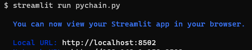
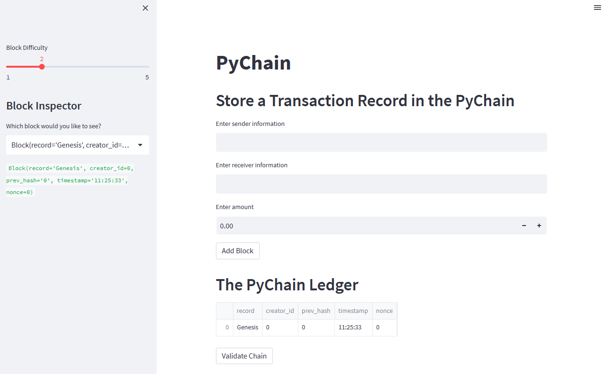
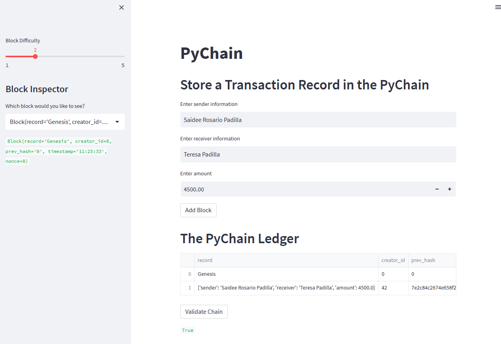

# Blockchain ledger

## Purpose
This application uses blockchain programing and it is deployed via Streamlit, which enables a web based interface. We demonstrate how a transaction transfers funds from one user to another, as a new block gets created, and the entry is recorded in the ledger. 

 
---
## Technologies and Libraries
### Python:
    Phyton Version: **3.7.13**

### Streamlit
[streamlit](https://streamlit.io/)

### Blockchain Ledger
[ledger](https://www.investopedia.com/tech/what-cryptocurrency-public-ledger/)

---
## USE CASE and DEMO

## Install streamlit
    pip install streamlit

## Run the application using streamlit
    streamlit run pychain.py

---
### Ledger launched and ready for use

### Transaction recorded 

---

---
## Contributors
- Startup code provided by UW FinTech Program

---
## License
Tool is available under an MIT License.

## Aknowledgements
* [Markdown Guide](https://www.markdownguide.org/basic-syntax/#reference-style-links)

<!-- MARKDOWN LINKS & IMAGES -->
<!-- https://www.markdownguide.org/basic-syntax/#reference-style-links -->